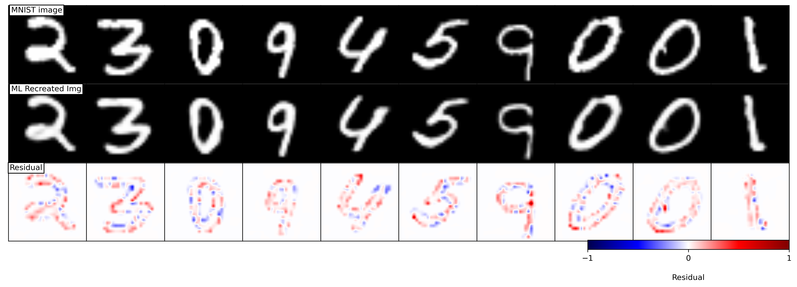
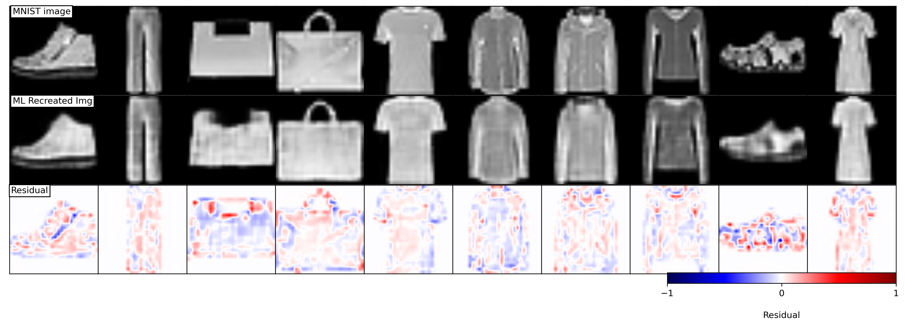
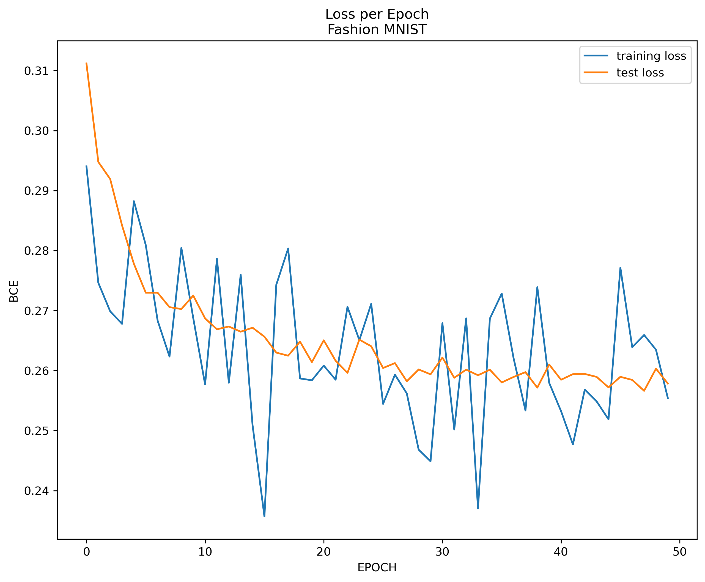

# NN Image Recreation
Data science project using Convolutional Neural Networks (CNN) for image recreation of the original and Fashion MNIST data set.

# Overview
For this project I built a Neural Network (NN) architecture capable of reproducing images. My goal with this project was to experiment with different NN architectures that made use of convolutional layers and different fully connected layers to reproduce images. A secondary goal was to show users that are new to the concept how to build more complex NNs and to serve as an inspiration (or reason) to incorporate convolutional layers in their work. [Convolutional layers](https://machinelearningmastery.com/convolutional-layers-for-deep-learning-neural-networks/) are used to filter out statistically significant and relevant features of an image thus allowing the model to better learn to recreate specific images. Even though there are many types of convolutional layers, this project only makes use of conventional layers, but there are many [posts](https://towardsdatascience.com/types-of-convolutions-in-deep-learning-717013397f4d) that mention other kinds and their relevance/efficiency to specific types of projects. The fundamentals laid out of in this project can be incorporated in more complex architectures that use far more complex data.

My architecure was able to reproduce nearly identical handwritten digit images and when we retrain the exact same model on a more complex data set, I was able to reproduce similar images but lack finer details on some classes (i.e. shoes and purses). For an architecure with relatively low complexity, the accuracy and time efficiency achieved would suffice most projects. I used the pytorch library to build my architecture which makes use of fully connected linear layers, activation functions, batch normalization functions and convolutional layers which are placed in specific orders to form stacks of hidden layers that are interconnected with one another from input to output. I trained the final architecture for 50 epochs (~45-50 minutes for first dataset and ~1 hour for second dataset) and it allowed me obtain solid results. To better visualize the results, I created a function that makes a wall plot and stacks it against the recreated image as well as the residual of both images to better see how the model performs on finer scale that our eyes may not be able to pick up on.

|  |
|:--:|
| <b>Fig 1 - As previously stated, the recreated number images are nearly identical. However, based on the residual plot, we can see that our model tend to saturate (over estimate) alongs the edges which make indicate that the model tries to round off the edges rather than preserve the ruggedness of the original image.</b>|

|  |
|:--:|
| <b>Fig 2.1 - When we retrain the model on a more complex data set, the reproduce images are nearly similar. However, if you look at recreated images of the shoes and purses, we notice that the surfaces lack details and the surface reproduced is smooth, this is more evident when we look at the residual plot at the bottom. Notice the strong shades of red and blue on the surfaces. </b>|

|  |
|:--:|
| <b>Fig 2.2 - Here I wanted to show how the model behaves over time. Due to the complexity of the images, the training error oscillates up and down while the testing error seems to converge on the late stages of our training. </b>|

# Notes
This project serves as a good starting point to anyone who's just getting started with NN or someone with a good understanding of NN and is trying to learn or see some sample code on convolutional layers. The source notebook contains comments throughout the code that explains the reasoning and/or some intuition about the function or hyperparameters. There are also some introduction block between some sections where I explain the goal of a preceding section, provide links where you can get some extra information or simply provide some inside knowledge about the dataset and/or about the model.

# Configurations
The running time during training can be long for the level of complexity of the model, so if possible, I would suugest using google colab for a project like this as you can use a gpu for faster result. If using google colab make sure to change the runtime on the settings from cpu to gpu.

# Data
I started by training and reproducing images from the well known [MNIST](http://yann.lecun.com/exdb/mnist/) dataset then from the more complex [Fashion-MNIST](https://github.com/zalandoresearch/fashion-mnist) dataset. If using pytorch, you can use their built-in [dataset loader](https://pytorch.org/vision/stable/datasets.html) to download both datasets.

# Sources and Inspiration
* https://github.com/jorgemarpa/PPDAE (Research mentor)
* https://github.com/EWolfe5/PPDAE
